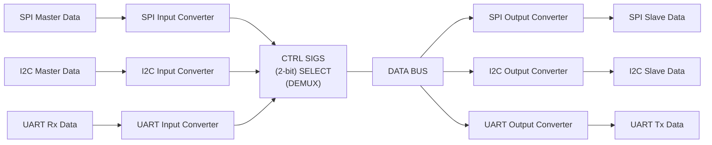

## Hardware & Architecture Overview

This project implements a **Multi-Protocol Conversion Unit** designed to translate serial communications dynamically between common embedded protocols.

## MPCU Block Diagram

### Hardware Platform
- **FPGA Board:** Digilent Arty A7-100T (Xilinx Artix-7 FPGA)
- **System Clock:** 100 MHz

### Supported Protocols & Conversion Topology
The system supports bidirectional conversion across three standard communication interfaces:
- **UART**
- **SPI**
- **I2C**

#### Key Features:
- **One-to-One Conversion:** Direct translation between any single protocol pair (e.g., UART to SPI, SPI to I2C, I2C to UART).
- **One-to-All Conversion:** Simultaneous broadcast/conversion from one primary protocol to all three remaining targets (e.g., UART input replicated to SPI and I2C outputs concurrently).
